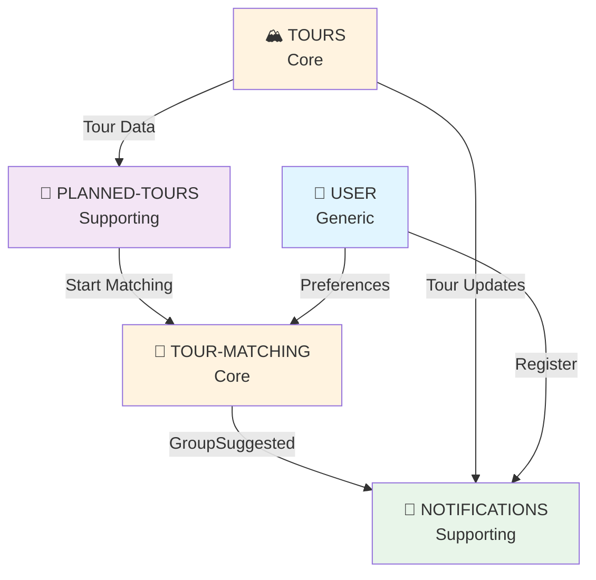
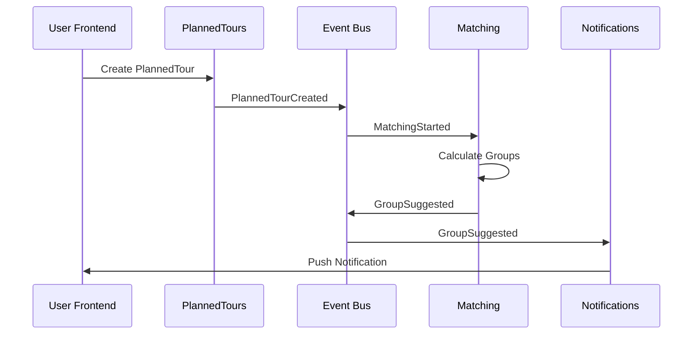
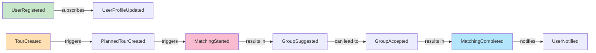
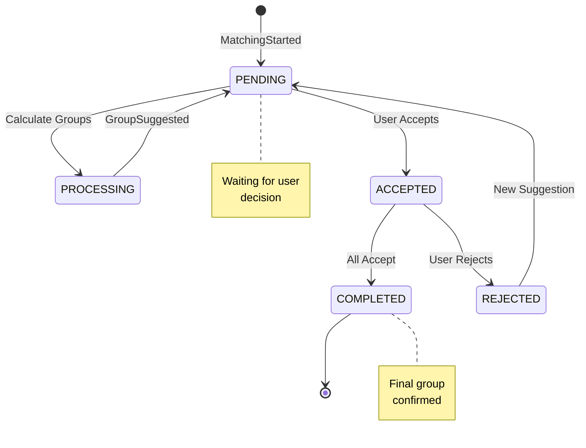
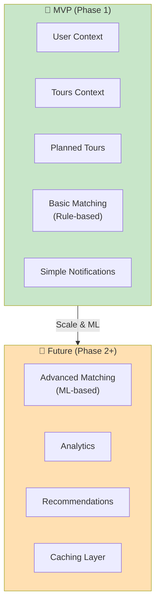
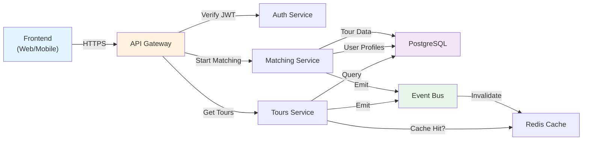
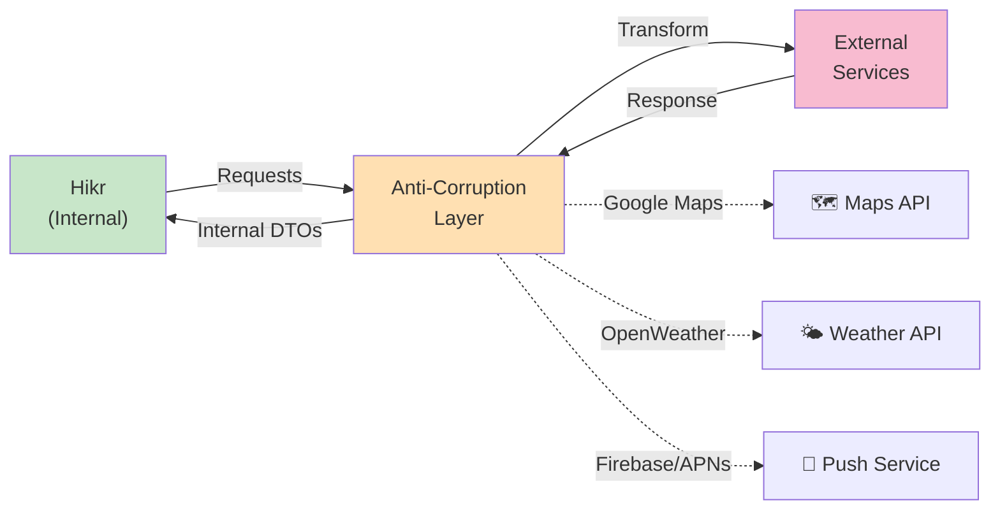

# Context Map Visualizations

**Version:** 0.1 (Draft)  
**Phase:** Strategic Design  
**Status:** 🚧 In Bearbeitung  

---

## 📊 Diagram 1: Bounded Contexts Overview

---

## 📊 Diagram 2: Integration Flows

---

## 📊 Diagram 3: Domain Events Chain

---

## 📊 Diagram 4: Matching State Machine

---

## 📊 Diagram 5: Context Dependency Matrix

| → von / zu ↓ | USER | TOURS | PLANNED-TOURS | MATCHING | NOTIFICATIONS |
|-------------|------|-------|--------------|----------|----------------|
| **USER** | - | - | - | Reads Prefs | - |
| **TOURS** | - | - | Reads Data | Reads Data | - |
| **PLANNED-TOURS** | Reads Auth | Reads Data | - | Triggers | - |
| **MATCHING** | Reads Prefs | Reads Data | Updates Status | - | Triggers |
| **NOTIFICATIONS** | - | - | - | - | - |

**Legende:**
- `-` = Keine Abhängigkeit
- `Reads` = Lesezugriff via Query
- `Triggers` = Event Publishing
- `Updates` = Direktes Update via API

---

## 📊 Diagram 6: MVP vs. Future

---

## 📊 Diagram 7: Data Flow

---

## 📊 Diagram 8: Anti-Corruption Layer

---

## 🎨 Color Legend

| Farbe | Bedeutung | Beispiele |
|-------|-----------|----------|
| 🟢 Grün | Core Domain | TOURS, MATCHING |
| 🟠 Orange | Supporting | PLANNED-TOURS, CACHE |
| 🔵 Blau | Generic | USER, AUTH |
| 🔴 Rot | External | 3rd Party Services |
| ⚪ Weiß | Infrastructure | Database, Event Bus |

---

## 📐 Architecture Principles

1. **Bounded Contexts sind voneinander unabhängig**
   - Jeder Context hat eigene DB
   - Kommunikation via Events

2. **Events sind für asynchrone Integration**
   - Loose Coupling zwischen Contexts
   - Bessere Skalierbarkeit

3. **Anti-Corruption Layers schützen vor Externe**
   - External APIs werden abgegrenzt
   - Hikr-interne Domain bleibt sauber

4. **User Context ist central**
   - Alle anderen Contexts lesen User-Daten
   - Authentifizierung bei jedem Request

---

## 🔍 Mermaid Live Editor

Diese Diagramme können in den Mermaid Live Editor kopiert werden:
👉 [https://mermaid.live](https://mermaid.live)

---

**Last Updated:** 2026-01-28  
**Nächste Update:** Nach Diagramm-Refinement mit Team
