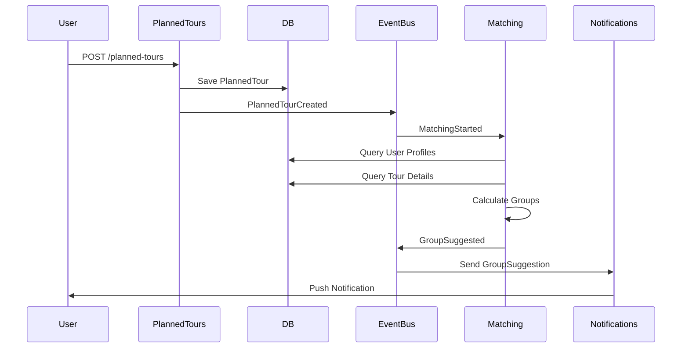
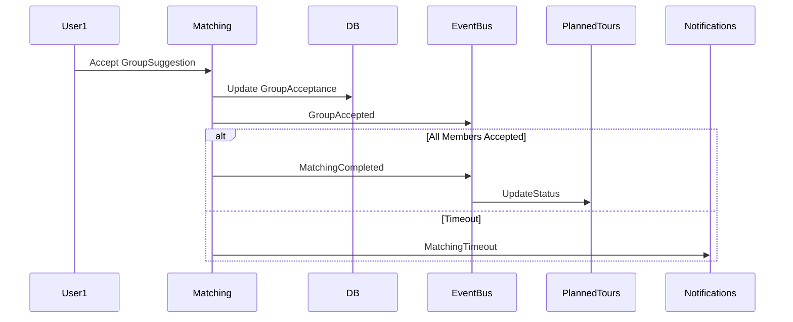

# Domain Events & Integrations

**Version:** 0.1 (Draft)  
**Phase:** Strategic Design  
**Status:** 🚧 In Bearbeitung  

---

## 📬 Domain Events Katalog

### Event 1: UserRegistered

**Context:** USER  
**Trigger:** Benutzer registriert sich  
**Payload:**
```yaml
{
  "eventId": "uuid",
  "eventType": "UserRegistered",
  "timestamp": "2026-01-28T10:00:00Z",
  "aggregateId": "user-123",
  "data": {
    "userId": "user-123",
    "username": "john_doe",
    "email": "john@example.com",
    "registrationDate": "2026-01-28T10:00:00Z"
  }
}
```

**Subscribers:**
- NOTIFICATIONS: Willkommens-Mail senden

---

### Event 2: TourCreated

**Context:** TOURS  
**Trigger:** Neue Tour wird angelegt  
**Payload:**
```yaml
{
  "eventType": "TourCreated",
  "aggregateId": "tour-456",
  "timestamp": "2026-01-28T10:15:00Z",
  "data": {
    "tourId": "tour-456",
    "title": "Alpspitz Trail",
    "difficulty": "MODERATE",
    "distance": 15.5,
    "elevation": 800,
    "startPoint": { "lat": 47.5, "long": 10.3 }
  }
}
```

**Subscribers:**
- Search Index: Tour indexieren
- Cache: Tour cachen

---

### Event 3: TourUpdated

**Context:** TOURS  
**Trigger:** Tour-Details geändert  
**Payload:**
```yaml
{
  "eventType": "TourUpdated",
  "aggregateId": "tour-456",
  "timestamp": "2026-01-28T11:00:00Z",
  "data": {
    "tourId": "tour-456",
    "changes": ["difficulty", "description"],
    "oldValues": { "difficulty": "EASY" },
    "newValues": { "difficulty": "MODERATE" }
  }
}
```

---

### Event 4: PlannedTourCreated

**Context:** PLANNED-TOURS  
**Trigger:** Benutzer bucht eine Tour  
**Payload:**
```yaml
{
  "eventType": "PlannedTourCreated",
  "aggregateId": "planned-tour-789",
  "timestamp": "2026-01-28T12:00:00Z",
  "data": {
    "plannedTourId": "planned-tour-789",
    "tourId": "tour-456",
    "scheduledDate": "2026-02-15",
    "scheduledTime": "09:00",
    "createdBy": "user-123",
    "capacity": 8
  }
}
```

**Subscribers:**
- NOTIFICATIONS: Booking-Confirmation senden

---

### Event 5: MatchingStarted

**Context:** TOUR-MATCHING  
**Trigger:** Matching-Process initiiert (von PlannedTour oder manuell)  
**Payload:**
```yaml
{
  "eventType": "MatchingStarted",
  "aggregateId": "matching-101",
  "timestamp": "2026-01-28T13:00:00Z",
  "data": {
    "matchingId": "matching-101",
    "plannedTourId": "planned-tour-789",
    "requestCount": 5,
    "algorithm": "compatibility-score-v1"
  }
}
```

---

### Event 6: GroupSuggested

**Context:** TOUR-MATCHING  
**Trigger:** Matching-Engine schlägt Gruppe vor  
**Payload:**
```yaml
{
  "eventType": "GroupSuggested",
  "aggregateId": "matching-101",
  "timestamp": "2026-01-28T13:15:00Z",
  "data": {
    "matchingId": "matching-101",
    "groupId": "group-202",
    "members": ["user-123", "user-456", "user-789"],
    "score": 0.87,
    "reason": "Similar fitness level, shared interests"
  }
}
```

**Subscribers:**
- NOTIFICATIONS: Gruppen-Vorschlag an alle Members senden

---

### Event 7: GroupAccepted

**Context:** TOUR-MATCHING  
**Trigger:** User akzeptiert Gruppen-Vorschlag  
**Payload:**
```yaml
{
  "eventType": "GroupAccepted",
  "aggregateId": "matching-101",
  "timestamp": "2026-01-28T14:00:00Z",
  "data": {
    "matchingId": "matching-101",
    "groupId": "group-202",
    "userId": "user-123",
    "acceptedAt": "2026-01-28T14:00:00Z"
  }
}
```

---

### Event 8: MatchingCompleted

**Context:** TOUR-MATCHING  
**Trigger:** Alle Members haben akzeptiert  
**Payload:**
```yaml
{
  "eventType": "MatchingCompleted",
  "aggregateId": "matching-101",
  "timestamp": "2026-01-28T15:00:00Z",
  "data": {
    "matchingId": "matching-101",
    "plannedTourId": "planned-tour-789",
    "finalGroup": {
      "groupId": "group-202",
      "members": ["user-123", "user-456", "user-789"],
      "score": 0.87
    },
    "completedAt": "2026-01-28T15:00:00Z"
  }
}
```

**Subscribers:**
- NOTIFICATIONS: Finale Bestätigung an Gruppe
- PLANNED-TOURS: Status updaten

---

## 🔄 Integration Patterns

### Pattern 1: Event Publishing (Pub/Sub)

**Verwendung:** Events zwischen Contexts austauschen

```
Event Source (z.B. TOURS Context)
    ↓
Event Bus (RabbitMQ, Kafka, JMS)
    ↓
Event Subscribers (NOTIFICATIONS, SEARCH, CACHE)
```

**Technologie:** 
- RabbitMQ (empfohlen für MVP)
- Kafka (zukünftig für Scale)
- Spring Cloud Stream (Abstraktion)

---

### Pattern 2: Event Sourcing (Optional)

**Verwendung:** Audit Trail & Temporal Queries

```
Command (CreateTour)
    ↓
Aggregate State Change
    ↓
Events emittieren (TourCreated)
    ↓
Event Store (DB)
    ↓
Materialized Views (read-optimized)
```

**Status:** Geplant für Phase 2

---

### Pattern 3: Saga Pattern (Distributed Transactions)

**Verwendung:** Multi-Context Workflows

```
1. PlannedTourCreated
2. → Matching Context: MatchingRequested
3. → Calculate Suggestions
4. → Send Notifications
```

**Orchestrator:** PLANNED-TOURS Context

---

## 🎬 Sequenz-Diagramme

### Flow: Planned Tour buchen & Matching starten



---

### Flow: Matching Decision



---

## 📊 Integration Matrix

| Von | Zu | Event | Trigger |
|----|----|-------|---------|
| TOURS | SEARCH | TourCreated | Tour indexieren |
| TOURS | CACHE | TourCreated | Tour cachen |
| USER | NOTIFICATIONS | UserRegistered | Willkommens-Mail |
| PLANNED-TOURS | MATCHING | PlannedTourCreated | Matching starten |
| MATCHING | NOTIFICATIONS | GroupSuggested | Gruppe vorschlagen |
| MATCHING | PLANNED-TOURS | MatchingCompleted | Status updaten |

---

## 🛡️ Error Handling

### Retry Strategy
- **Transient Errors:** Exponential backoff (3 retries)
- **Persistent Errors:** Dead Letter Queue

### Event Idempotency
```java
// Duplikate vermeiden
@Idempotent(idempotencyKey = "event.eventId")
void handleGroupAccepted(GroupAcceptedEvent event) {
    // ...
}
```

---

## 📱 Notification Types

| Notification Type | Channel | Timing |
|------------------|---------|--------|
| GROUP_SUGGESTION | Push | Immediately |
| GROUP_ACCEPTED | Email | Immediately |
| TOUR_REMINDER | Push | 24h before |
| MATCHING_TIMEOUT | Email | After timeout |

---

## 🚀 Next Steps

1. Event Store implementieren (SQL Audit Table)
2. Pub/Sub Middleware (RabbitMQ) einrichten
3. Dead Letter Queue für failed events
4. Event Replay für Debugging

---

**Last Updated:** 2026-01-28  
**Nächste Update:** Nach Event-Katalog Refinement
